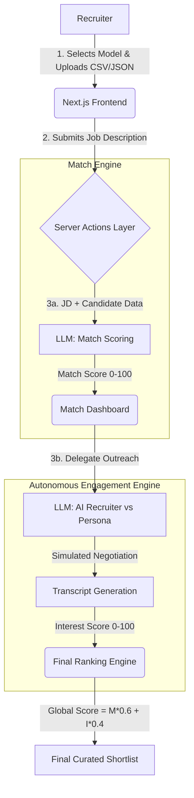

# Luminal Scout | Autonomous AI Talent Agent

**Live Deployment:** [https://catalyst-ai-hackathon.vercel.app/](https://catalyst-ai-hackathon.vercel.app/)

An AI-Powered Talent Scouting & Engagement Agent built for the Deccan AI Catalyst Hackathon.

## Overview
Recruiters spend hours sifting through profiles and chasing candidate interest. Luminal Scout automates the *discovery* and *early engagement* phases. It ingests a Job Description (JD) and a raw talent database (exported from an ATS or LinkedIn), matches candidates, and *autonomously* engages them in the background using a simulated AI-to-AI conversation to gauge genuine interest. 

It outputs a composite final ranking based on both technical fit (Match Score) and the candidate's responsiveness (Interest Score).

## Core Features
1. **Multi-Model Intelligence:** Not locked into one ecosystem. Users can select between **Gemini 2.5 Flash**, **OpenAI (GPT-4o)**, or **Anthropic (Claude 3.5)** depending on their API keys. (If no key is provided, it safely falls back to the server's default key).
2. **Dynamic ATS / Database Ingestion:** Companies typically receive candidate lists via exports from ATS systems (Greenhouse, Workable) or sourcing tools (Apollo, LinkedIn). Luminal Scout natively accepts **.CSV or .JSON file uploads** to dynamically populate the candidate pool for any search.
3. **Autonomous Engagement Simulation:** The Agent spins up a background simulation where the "AI Recruiter" pitches the role to a "Candidate persona" (who evaluates the pitch based on hidden salary/job satisfaction variables).

---

## Architecture Diagram


## Architecture & Logic
The application is a monolith built with **Next.js (React)** and **Tailwind CSS**, deployed directly to Vercel.

### 1. Frontend (UI Layer)
- **Framework:** Next.js (Client Components)
- **Styling:** Tailwind CSS, `framer-motion` for fluid pipeline transitions. High-end "Luminal Scout" design system generated via StitchMCP (dark mode, glassmorphism, glowing telemetry).
- **State Management:** React `useState` and `useRef` to govern the pipeline progression.
- **Data Ingestion:** Uses `papaparse` to accept `.CSV` or `.JSON` database uploads directly in the UI, mimicking how companies extract candidate graphs from ATS platforms.

### 2. Backend (Server Actions)
- **Logic:** Handled natively via Next.js Server Actions (`src/app/actions.ts`), ensuring secure execution of logic without exposing candidate datasets or prompt templates on the client.
- **Multi-Model Inference Engine:** The system routes requests dynamically based on the user's provider choice:
  - **Google Gemini 2.5 Flash** (`@google/genai`)
  - **OpenAI GPT-4o-mini** (`openai`)
  - **Anthropic Claude 3.5 Haiku** (`@anthropic-ai/sdk`)
- **JSON Structure Mode:** All models are prompted or configured strictly for structured JSON output to seamlessly flow into the Next.js frontend state.
- **Batched Engine Optimization:** To prevent Vercel Serverless Function timeouts, the Match Engine compiles all candidates into a single JSON payload and scores them simultaneously, dropping processing latency from 20s+ to ~2s.

### 3. Core Logic & Scoring
- **Match Score Engine:** The JD and raw candidate profile are injected into an evaluation prompt. The AI outputs a strict `Match Score (0-100)` and an `explanation`.
- **Interest Score Engine (Autonomous):** The system triggers a single-shot Gemini simulation involving an "AI Recruiter" and a "Candidate Persona". The Candidate is initialized with hidden variables. The LLM generates a full 3-4 turn transcript of the pitch and negotiation, and extracts a final `Interest Score`.
- **Global Ranking Engine:** The agent ultimately builds a final shortlist by combining technical aptitude and active interest:
  `Global Score = (Match Score * 0.6) + (Interest Score * 0.4)`

---

## Sample Inputs and Outputs

### Sample Input (CSV Data ingested by the system)
```json
[
  {
    "id": "c1",
    "name": "Alex Chen",
    "role": "Senior ML Engineer",
    "skills": "Python, PyTorch, LLMs, RAG, AWS",
    "experience": "5 years building recommendation systems at Spotify",
    "location": "Remote",
    "salary_expectation": "180k",
    "personality_context": "Direct, values technical challenges, unhappy with current corporate bureaucracy"
  }
]
```

### Sample Input (Job Description)
```text
Looking for a Senior AI Engineer to join our fast-paced startup. 
Must have experience deploying LLMs, building RAG pipelines, and strong Python/PyTorch skills. 
We operate fully remote. Budget: $150k - $170k.
```

### Sample Output (Match Score Phase)
```json
{
  "candidateId": "c1",
  "matchScore": 92,
  "explanation": "Alex has exact overlap with PyTorch, LLMs, and RAG pipelines. However, their salary expectation ($180k) is slightly above the max budget ($170k)."
}
```

### Sample Output (Engagement Phase Transcript & Interest Score)
```json
{
  "interestScore": 45,
  "transcript": [
    {
      "speaker": "AI Recruiter",
      "text": "Hi Alex! I'm scouting for a fast-paced startup looking for a Senior AI Engineer to build RAG pipelines. It's fully remote with a budget of $170k. Would this interest you?"
    },
    {
      "speaker": "Candidate",
      "text": "The technical stack sounds perfect, especially getting away from corporate bureaucracy. However, my hard floor for moving right now is $180k. Is there any flexibility on the budget?"
    },
    {
      "speaker": "AI Recruiter",
      "text": "I completely understand. While $170k is the stated budget, fast-paced startups often have equity upside or signing bonuses we could discuss. Would you be open to an introductory call?"
    },
    {
      "speaker": "Candidate",
      "text": "I'd take the call to hear about the equity, but I'm hesitant to move without the base salary match."
    }
  ]
}
```

### Final Global Score Output
`Global Score: 73.2` *(92 Match * 0.6 + 45 Interest * 0.4)*. The recruiter immediately sees Alex is a great technical fit, but high flight risk due to the salary gap, saving a wasted initial phone screen.

---

## APIs & Tools Declared
- **Google Gemini API**, **OpenAI API**, **Anthropic API**: Used exclusively for Match reasoning, generating explainability, and candidate persona simulation. (Free/Trial tiers used, no credits provided).
- **Next.js & React**: Core web framework.
- **Framer Motion**: Animations.
- **Tailwind CSS**: Styling and UI aesthetics.
- **PapaParse**: CSV processing engine.

---

## How to Run Locally

### Prerequisites
- Node.js (v18+)
- An API Key from Google AI Studio, OpenAI, or Anthropic.

### Steps
1. Clone the repository.
   ```bash
   git clone https://github.com/VyomKulshrestha/catalyst-ai-hackathon.git
   cd catalyst-ai-hackathon
   ```
2. Install dependencies:
   ```bash
   npm install
   ```
3. Run the development server:
   ```bash
   npm run dev
   ```
4. Open [http://localhost:3000](http://localhost:3000) with your browser.
5. Provide your API key in the UI, upload a CSV of candidates, and test the scout!

## Demo Video
*(Your Demo Video Link Here)*
