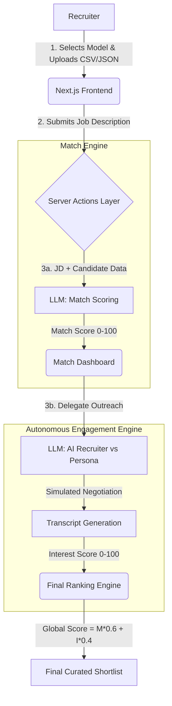

# Luminal Scout - Write-Up

**Live Deployment:** [https://catalyst-ai-hackathon.vercel.app/](https://catalyst-ai-hackathon.vercel.app/)

## Approach
Automating talent acquisition usually stops at parsing resumes and matching keywords. Luminal Scout goes further by attempting to automate the *discovery* and *early engagement* phases autonomously. The approach operates in two main loops:
1. **The Match Loop:** Translating a raw Job Description (JD) into structured logic, evaluating a candidate pool, and generating a 0-100 `Match Score` along with human-readable "explainability".
2. **The Engagement Loop:** Creating autonomous AI simulations. The system runs background interactions where an AI Recruiter pitches the role to a simulated Candidate persona. The Candidate responds authentically while updating a hidden `Interest Score` based on their secret profile parameters (salary needs, job satisfaction, preferred tech stack).

## Architecture
The application is a monolith built with **Next.js (React)** and **Tailwind CSS**, deployed directly to Vercel.

### Architecture Diagram


### 1. Frontend (UI Layer)
- **Framework:** Next.js (Client Components)
- **Styling:** Tailwind CSS, `framer-motion` for fluid pipeline transitions. High-end "Luminal Scout" design system generated via StitchMCP (dark mode, glassmorphism, glowing telemetry).
- **State Management:** React `useState` and `useRef` to govern the pipeline progression.
- **Data Ingestion:** Uses `papaparse` to accept `.CSV` or `.JSON` database uploads directly in the UI, mimicking how companies extract candidate graphs from ATS platforms (Greenhouse, Workable) or sourcing tools (LinkedIn, Apollo).

### 2. Backend (Server Actions)
- **Logic:** Handled natively via Next.js Server Actions (see `src/app/actions.ts`), ensuring secure execution of logic without exposing candidate datasets or prompt templates on the client.
- **Multi-Model Inference Engine:** The system routes requests dynamically based on the user's provider choice, using the official SDKs:
  - **Google Gemini 2.5 Flash** (`@google/genai`)
  - **OpenAI GPT-4o** (`openai`)
  - **Anthropic Claude 3.5** (`@anthropic-ai/sdk`)
- **JSON Structure Mode:** All models are prompted or configured strictly for structured JSON output to seamlessly flow into the Next.js frontend state.

### 3. Core Logic & Scoring
- **Match Score Engine:** The JD and raw candidate profile are injected into an evaluation prompt. The AI outputs a strict `Match Score (0-100)` and an `explanation`.
- **Interest Score Engine (Autonomous):** The system triggers a single-shot Gemini simulation involving an "AI Recruiter" and a "Candidate Persona". The Candidate is initialized with hidden variables. The LLM generates a full 3-4 turn transcript of the pitch and negotiation, and extracts a final `Interest Score`.
- **Global Ranking Engine:** The agent ultimately builds a final shortlist by combining technical aptitude and active interest:
  `Global Score = (Match Score * 0.6) + (Interest Score * 0.4)`

## Trade-Offs & Future Work
1. **Mock Database vs. Real API:** Due to the time constraints and lack of access to real ATS data, the application uses a mocked `candidates.json`. In production, this would be an API call to LinkedIn, Greenhouse, or a Vector Database.
2. **LLM Evaluation Latency:** Evaluating candidates sequentially via Gemini can be slow. In a production build, these calls would be batched or executed asynchronously via a background queue (e.g. BullMQ).
3. **Conversational Drift:** The engagement loop is currently simplistic. A candidate prompt can drift after a long conversation. Given more time, we would implement LangChain or strict interaction graphs to bound the candidate persona behavior.
4. **Scoring Weightage:** The 60/40 Match/Interest ratio is hardcoded. It would ideally be a user-adjustable slider depending on how desperately the recruiter needs passive talent vs. exact technical fits.

## APIs & Tools Declared
- **Google Gemini API** (Gemini 2.5 Flash), **OpenAI**, **Anthropic**: Used exclusively for Match reasoning, generating explainability, and candidate persona simulation. (Free/Trial tiers used, no credits provided).
- **Next.js & React**: Core web framework.
- **Framer Motion**: Animations.
- **Tailwind CSS**: Styling and UI aesthetics.
- **PapaParse**: CSV processing engine.

---

## Sample Inputs and Outputs

### Sample Input (CSV / JSON Data ingested by the system)
```json
[
  {
    "id": "c1",
    "name": "Alex Chen",
    "role": "Senior ML Engineer",
    "skills": "Python, PyTorch, LLMs, RAG, AWS",
    "experience": "5 years building recommendation systems at Spotify",
    "location": "Remote",
    "salary_expectation": "180k",
    "personality_context": "Direct, values technical challenges, unhappy with current corporate bureaucracy"
  }
]
```

### Sample Input (Job Description)
```text
Looking for a Senior AI Engineer to join our fast-paced startup. 
Must have experience deploying LLMs, building RAG pipelines, and strong Python/PyTorch skills. 
We operate fully remote. Budget: $150k - $170k.
```

### Sample Output (Match Score Phase)
```json
{
  "candidateId": "c1",
  "matchScore": 92,
  "explanation": "Alex has exact overlap with PyTorch, LLMs, and RAG pipelines. However, their salary expectation ($180k) is slightly above the max budget ($170k)."
}
```

### Sample Output (Engagement Phase Transcript & Interest Score)
```json
{
  "interestScore": 45,
  "transcript": [
    {
      "speaker": "AI Recruiter",
      "text": "Hi Alex! I'm scouting for a fast-paced startup looking for a Senior AI Engineer to build RAG pipelines. It's fully remote with a budget of $170k. Would this interest you?"
    },
    {
      "speaker": "Candidate",
      "text": "The technical stack sounds perfect, especially getting away from corporate bureaucracy. However, my hard floor for moving right now is $180k. Is there any flexibility on the budget?"
    },
    {
      "speaker": "AI Recruiter",
      "text": "I completely understand. While $170k is the stated budget, fast-paced startups often have equity upside or signing bonuses we could discuss. Would you be open to an introductory call?"
    },
    {
      "speaker": "Candidate",
      "text": "I'd take the call to hear about the equity, but I'm hesitant to move without the base salary match."
    }
  ]
}
```

### Final Global Score Output
`Global Score: 73.2` *(92 Match * 0.6 + 45 Interest * 0.4)*. The recruiter immediately sees Alex is a great technical fit, but high flight risk due to the salary gap, saving a wasted initial phone screen.
